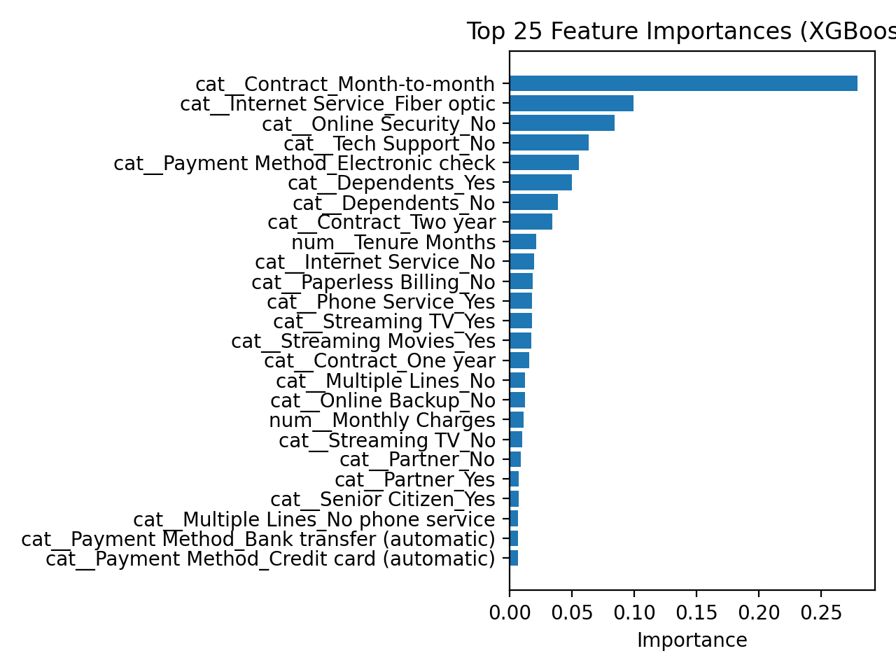
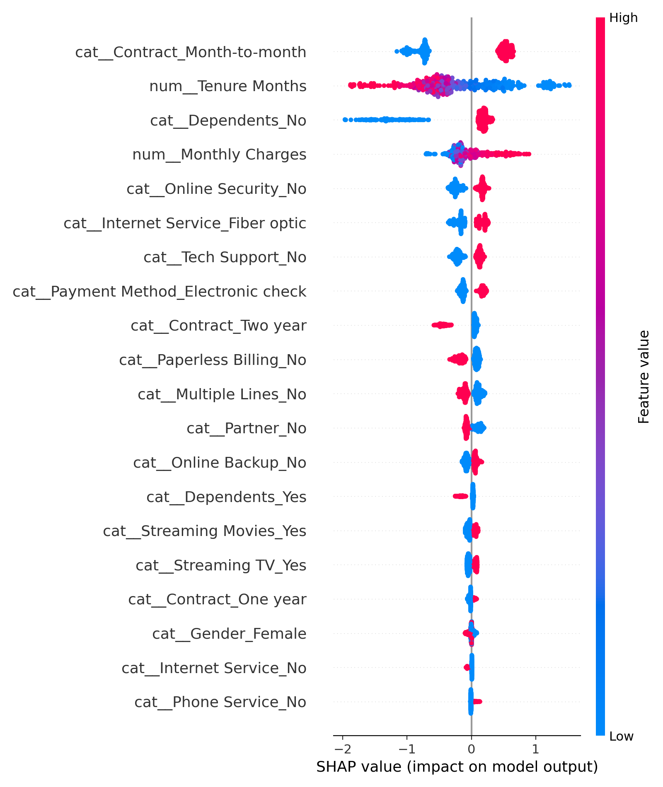

# Model Explainability: Why Are Customers Churning?
- **Churn:** In simple terms, When a customer stops using a company’s service or subscription and leaves for better option or cancels altogether.
- This document explains **how and why** the final churn prediction model makes its decisions.

the GOAL of this project **is to demonstrate that I can create models that produce predictions which are:**
- interpretable
- explainable
- production ready

To achieve this, two complementary explainability approaches were used:
1. Feature importance
2. SHAP plotting

## 1. Global Feature Importance

It shows which *input features matters in overall prediction* across all customers.

The plot below shows the **top most influential features** from the tuned XGBoost model.

### Key observations

- **Contract type** is the strongest churn signal:
  - Month-to-month contracts significantly increase churn risk
  - One-year and two-year contracts reduce churn likelihood

- **Internet service type matters**:
  - Fiber optic customers churn more frequently than DSL or no-internet customers

- **Service quality indicators**:
  - Lack of online security or tech support is associated with higher churn

- **Customer tenure**:
  - Short-tenure customers are more likely to churn

**Other thing we can observe is that demographic features (such as gender) have relatively low importance compared to service, contract, and pricing factors.**

## 2. SHAP Analysis

SHAP explains:
- how each feature contributes to predictions
- whether it pushes churn probability **up or down**
- how effects differ across individual customers

The SHAP summary plot below visualizes feature impact across the dataset.

### How to read this plot

- Each dot represents a customer
- Red values indicate high feature values
- Blue values indicate low feature values
- Dots to the **right** increase churn probability
- Dots to the **left** decrease churn probability

